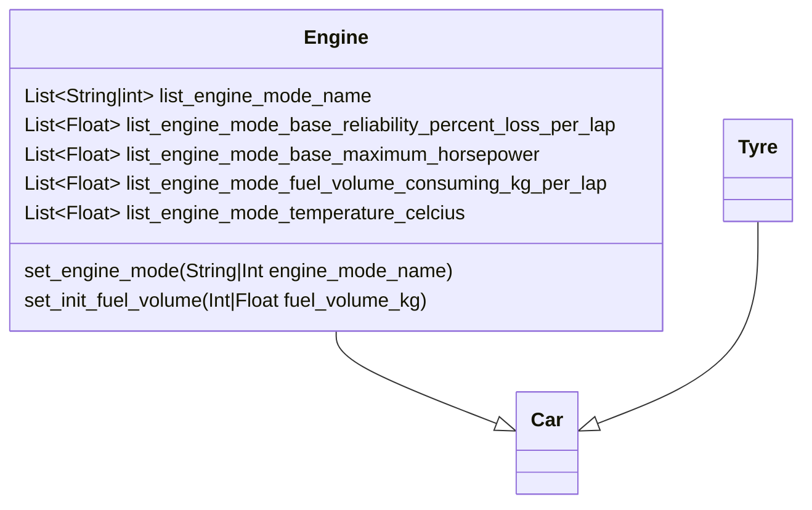

```mermaid
classDiagram
Engine --|> Car
Tyre --|> Car
class Engine{
    List~String|int~ list_engine_mode_name
    List~Float~ list_engine_mode_base_reliability_percent_loss_per_lap
    List~Float~ list_engine_mode_base_maximum_horsepower
    List~Float~ list_engine_mode_fuel_volume_consuming_kg_per_lap
    List~Float~ list_engine_mode_temperature_celcius

    set_engine_mode(String|Int engine_mode_name)
    set_init_fuel_volume(Int|Float fuel_volume_kg)
}
```