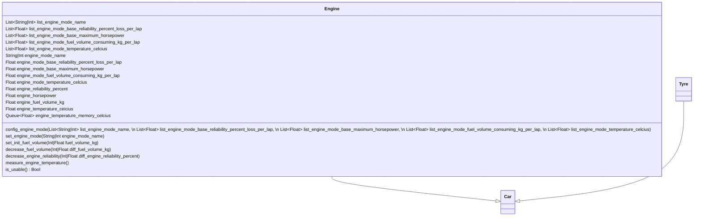

```mermaid
classDiagram
Engine --|> Car
Tyre --|> Car
class Engine{
    List~String|Int~ list_engine_mode_name
    List~Float~ list_engine_mode_base_reliability_percent_loss_per_lap
    List~Float~ list_engine_mode_base_maximum_horsepower
    List~Float~ list_engine_mode_fuel_volume_consuming_kg_per_lap
    List~Float~ list_engine_mode_temperature_celcius

    String|Int engine_mode_name
    Float engine_mode_base_reliability_percent_loss_per_lap
    Float engine_mode_base_maximum_horsepower
    Float engine_mode_fuel_volume_consuming_kg_per_lap
    Float engine_mode_temperature_celcius

    Float engine_reliability_percent
    Float engine_horsepower
    Float engine_fuel_volume_kg
    Float engine_temperature_ceicius

    Queue~Float~ engine_temperature_memory_celcius

    config_engine_mode(List~String|Int~ list_engine_mode_name, \n List~Float~ list_engine_mode_base_reliability_percent_loss_per_lap, \n List~Float~ list_engine_mode_base_maximum_horsepower, \n List~Float~ list_engine_mode_fuel_volume_consuming_kg_per_lap, \n List~Float~ list_engine_mode_temperature_celcius)
    set_engine_mode(String|Int engine_mode_name)
    set_init_fuel_volume(Int|Float fuel_volume_kg)
    decrease_fuel_volume(Int|Float diff_fuel_volume_kg)
    decrease_engine_reliability(Int|Float diff_engine_reliability_percent)
    measure_engine_temperature()
    is_usable() Bool
}
```